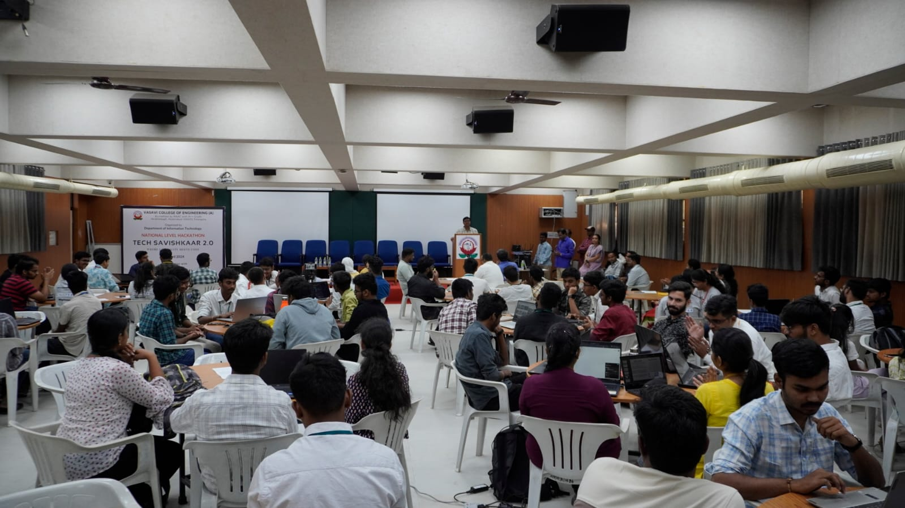

# Tech Savishkaar 4.0

> A 24-hour inter-collegiate hackathon organized by the Department of IT, Vasavi College of Engineering.



## 🚀 Event Details

- **Date**: January 25-26, 2026
- **Location**: Vasavi College of Engineering, Hyderabad
- **Theme**: "Innovate for a Better Tomorrow"
- **Team Size**: 1-4 members
- **Prizes**: ₹1,25,000 in total prizes

## 🎯 Tracks

- **AgriTech**
- **AIML for Remote Sensing – Environment & Sustainable Development**
- **HealthTech**
- **Cyber Security**

## 🛠️ Built With

- **Frontend**: React, TypeScript, Vite
- **3D Graphics**: Three.js, React Three Fiber
- **Styling**: CSS3, CSS Variables
- **Animation**: Framer Motion, GSAP
- **Deployment**: Vercel/Netlify

## 🚀 Quick Start

1. **Clone the repository**
   ```bash
   git clone https://github.com/AkshithaReddy005/Tech-Savishkaar-4.0.git
   cd Tech-Savishkaar-4.0
   ```

2. **Install dependencies**
   ```bash
   npm install
   # or
   yarn
   ```

3. **Start development server**
   ```bash
   npm run dev
   # or
   yarn dev
   ```

4. **Build for production**
   ```bash
   npm run build
   npm run preview
   ```

## 📁 Project Structure

```
src/
├── components/     # Reusable UI components
├── sections/      # Page sections
├── styles/        # Global styles and themes
├── utils/         # Helper functions
└── App.tsx        # Main application component
```

## 🤝 Contributing

1. Fork the repository
2. Create your feature branch (`git checkout -b feature/AmazingFeature`)
3. Commit your changes (`git commit -m 'Add some AmazingFeature'`)
4. Push to the branch (`git push origin feature/AmazingFeature`)
5. Open a Pull Request

## 📝 License

This project is licensed under the MIT License - see the [LICENSE](LICENSE) file for details.

## 🙏 Acknowledgments

- Vasavi College of Engineering
- Department of Information Technology
- All participants and mentors

---

<div align="center">
  Made with ❤️ by the Tech Savishkaar Team
</div>
